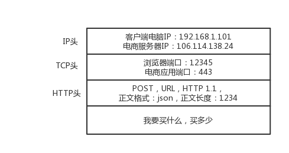

# learn_network
## 0.个人说明
```text
原文地址：https://time.geekbang.org/column/article/7581

个人声明：
优秀的人帮我们总结了精华，而我之所以会写下来，一方面能加深我对知识的理解，另一方面也能够让我散发性思维思考。
此文不会用于商业用途，只是用于自我知识的积累。
```

## 1.为什么要学习网络协议
《圣经》中有一个通天塔的故事，大致是说，上帝为了阻止人类联合起来，就让人类说不同的语言。
人类没办法沟通，达不成“协议”，通天塔的计划就失败了。

但是千年以后，出现了一种“程序猿”的物种，敲着一种这个群体通用的语言，连接着全世界所有的人，打造着互联网世界通天塔。
如今的世界，正因为互联网，才连接在一起。

当“Hello world!”从显示器上打印出来的时候，你是否还记得激动的心情？
```java
public class HelloWorld {
    public static void main(String[] args) {
        System.out.println("Hello World!")
    }
}
```
如果你是程序员，一定看的懂上面这一段代码。这是每个程序员向计算机世界说“你好，世界！”的方式。
但是，你一定不知道，这段代码文字也是一种协议，是人类与计算机沟通的协议，只有通过这种协议，计算机才知道我们想让它干什么。


当然，这种协议还是更接近人类语言，机器不能直接读懂，需要进行翻译，翻译的工作需要交给编译器（compile）。
编译器过程如下：

计算机语言作为程序员控制一台计算机工作的协议，具备了三要素（即，**协议三要素**）：
* 语法，就是一段内容要符合一定规则和格式。比如，括号成对，结束要使用分号等
* 语义，就是这一段内容要表达的意义。比如，数字减去数字是有意义的，数字减去文本就没有意义。
* 顺序，就是先做什么，后做什么。比如，你可以先加上某个数值，在减去某个数值。


学会了计算机语言，你就能够教一台计算机完成你的工作了。

但是，想要打造互联网的通天塔，只教给一台计算机做什么是不够的，你需要学会教很多机器做什么。这时就需要网络协议。
只有通过网络协议，才能使很多机器互相协作、共同完成一件事。


网络协议是什么样子，这么神奇？举例说明：  
当你想买一个商品，常规的做法就是打开浏览器，输入购买网站的地址，浏览器会返回给你一个缤纷多彩的页面。  

那你有没有想过，浏览器是如何做到这件事情的？  
它之所以能够显示缤纷多彩的页面，是因为它收到了一段来自HTTP协议的东西。例如：  
```
HTTP/1.1 200 ok
Date: Tue,27 Mar 2018 16:50:26 GMT
Content-Type: text/html;charset=UTF-8
Content-Language: zh-CN

<!DOCTYPE html>
<html>
<head>
<base href="https://pages.kaola.com/">
<meta charset="utf-8"><title>网易考拉3周年主会场</title>
```
它是否符合协议三要素呢？我们来看一下：  
首先，符合语法，也就是说，只有按照上面那个格式来，浏览器才认。比如，先是状态，后是首部，其次是内容。  
其次，符合语义，就是按照约定的意思来。比如，状态200表示网页成功返回。  
然后，符合顺序，你一点浏览器，就发出一个HTTP请求，然后才有上面那一串HTTP返回的东西。  
最后，浏览器按照协议商定好的将一个五彩缤纷的页面展现给你。  


我们常用的网络协议有哪些？我们可以通过“双十一”案例来分析一下：  
你先在浏览器中输入“https//www.kaola.com”这个URL，浏览器只知道名字是“www.kaola.com”，但是不知道具体地址，
所以不知道应该如何访问。于是，它打开地址簿去查找。可以使用一般的地址簿去查找，也可以使用更加精准的地址簿查找协议HTTPDNS。

无论使用哪种方法查找地址簿，最终都会得到一个地址：106.114.138.24.这个就是IP地址，是互联网的门牌号。

知道了目标地址，浏览器就开始打包它的请求。对于普通的浏览器，往往会使用HTTP协议；但是对于购物请求，往往需要进行加密传输，
因而会使用HTTPS协议。无论什么协议，里面都要写明“你买什么和要买多少”。  
应用层封装包：  


DNS、HTTP、HTTPS所在的层我们称为应用层。经过应用层的封装后，浏览器会将应用层的包交给下一层去完成，通过Socket编程来实现。
下一层是传输层，传输层有两种协议：一种是无连接的UDP，另一种是面向连接的协议TCP。对于支付来说，往往使用TCP。
所谓的面向连接协议就是，TCP会保证这个包能够到达目的地。如果不能到达，就会重新发送，直至到达。

TCP协议里面会有两个端口，一个是浏览器监听的端口，一个是电商的服务器监听端口。操作系统往往通过端口来判断，它得到的包应该给哪个进程。  
传输层封装包：  


传输层封装完后，浏览器会将包交给操作系统的网络层。网络层的协议是IP协议。
在IP协议里面会有 源IP地址（即浏览器所在机器的IP地址） 和 目标IP地址（即，电商网站所在服务器IP地址）。  
网络层封装包：  


操作系统知道了目标IP地址，就开始想如何通过这个门牌号找到目标机器。操作系统会判断，这个目标IP地址是本地人，还是外地人。
如果是本地人，从门牌号就能看出来，但是显然电商的网站不在本地，而在遥远的地方。  

操作系统要知道离开本地去远方。虽然不知道远方在何处，但可以类比一下：如果去国外要去海关，去外地就要去网关。
而操作系统启动的时候，就会被DHCP协议配置IP地址，以及默认网关IP地址192.168.1.1。

操作系统如何将IP地址转发给网关呢？在本地通信基本靠吼，于是操作系统大吼一声，谁是192.168.1.1啊？网关会回答它，我就是，
我的本地地址在村东头。这个本地地址就是MAC地址，而那一声大吼就是ARP协议。 于是，操作系统将IP包交给了下一层，也就是MAC层。
网卡再将包发出去，由于这个包里面是由MAC地址的，因此它能够到达网关。  
数据链路层封包:  


网关收到包后，会根据自己的地址簿，判断下一步该怎么走。网关往往是一个路由器，到某个地址怎么走，这个叫路由表。  
路由器有点像玄奘西行路上通过的一个个城关。每个城关都连着两个国家，每个国家相当于一个局域网，在每个国家内部，都可以使用本地地址MAC通信。
一旦跨越城关，就需要拿出IP头来，里面写着贫僧从东土大唐（源IP地址）而来，欲往西天拜佛求经（目标IP地址），路过宝地，借宿一晚，
明日启程，请问接下来该怎么走啊？  
路由表选址：  


城关往往知道这些“地址簿”的，因为城关和临近的城关会经常沟通。到哪里应该怎么走，这种沟通的协议称为路由协议，常用OSPF和GBP。  

城关和城关之间是一个国家，当网络包知道下一步去哪个城关后，还是要使用国家内部的MAC地址，通过下一个城关的MAC地址，找到下一个城关，
然后再问下一步的路该怎么走，一直走出最后一个城关。

最后一个城关知道这个网络包要去的地方。于是，对着这个国家吼一声，谁是目标IP啊？目标服务器就会回复一个MAC地址。
网络包过关后，通过这个MAC地址就能找到目标服务器。

目标服务器发现MAC地址对上了，取下MAC头来，发送给操作系统的网络层。网络层发现IP地址也对上了，就取下IP头。
IP头会写上上一层封装的是TCP协议，然后将其交给传输层，即TCP层。 在这一层里，对于收到的每一个包，都会有一个回复的包说明收到了。
这个回复的包绝非这次下单请求的结果，例如：你购物是否成功，扣了多少钱，而仅仅是TCP层的一个说明，即收到包的回复。
当然这个回复会沿着刚才来的方向走回去，报个平安。如果过了一段时间还没到，发送端的TCP层会重新发送这个包，还是上面的过程，
直到有一天收到平安到达的回复。这个重试绝非你的浏览器重新将下单这个动作重复异常。对于浏览器来讲，就发送了一次下单请求，
TCP层会不断自己闷头重试，除非TCP这一层出了问题，例如断连，才轮到浏览器的应用层重新发送下单请求。

当网络包平安到达TCP层之后，TCP头中有目标端口号，通过这个端口号，可以找到电商网站的进程正在监听这个端口号，
假设是一个Tomcat，然后就将包发送给电商网站。电商网站的进程得到HTTP请求的内容，知道了要买的东西，买多少。
往往一个电商网站最初接待请求的这个tomcat只是个接待员，负责统筹处理这个请求，而不是所有的事情都自己做。
例如：这个接待员要告诉专门管理订单的进程，登记要买某个商品，买多少；要告诉管理库存的进程，库存要减多少；
告诉支付的进程，应该付多少钱，等等。

如何告诉相关进程呢？往往通过RPC调用，即远程过程调用的是方式来实现。远程过程调用就是当告诉管理订单进程的时候，
接待员不用关系中间的网络互连问题，会由RPC框架统一处理。RPC框架有很多种，有基于HTTP协议放在HTTP报文里面的，
有直接封装在TCP报文里面的。

当接待员发现相应的部门都处理完毕，就回复一个HTTPS包，告知下单成功。这个HTTPS的包，会向来的时候一样，经过千难万险到达到你的个人电脑，
最终进入浏览器，显示支付成功。


## 2.网络分层的含义是什么？
当你听到二层设备、三层设备、四层LB和七层LB中层的时候，是否有点一头雾水，不知道这些所谓的层，对应的各种协议具体要做什么“工作”？  

1.这四个问题你真的懂了吗？
教科书或老师往往会打一个十分不恰当的比喻：为什么网络要分层啊？因为不同层次之间有不同的沟通方式，这个叫作协议。
教科书会列出每层所包含的协议，然后开始逐层地去将这些协议。但是这些协议之间的关系呢？却很少有教科书会讲。

比如：一家公司也是分“层次”的，分总经理、经理、组长、员工。总经理之间有他们的沟通方式，经理和经理也有沟通方式，同理组长和员工。
那么第一个问题，请问经理在握手的时候，员工在干什么？

很多人听过TCP建立连接的三次握手协议，也把它当作知识点来背。同理问你，TCP在三次握手的时候，IP层和MAC层对应有什么操作？

在学习到三层的时候会提到，IP协议里面包含目标地址和源地址。第三层还会学习路由协议。路由就像中转站，我们从原始地址A到目标地址D，
要经过两个中转站 A -> B -> C -> D，是通过路由转发的。  
那么第二个问题，A知道自己的下一个中转站是B，那从A发出的包，应该把B的IP地址放在哪里呢？B知道自己的下一个中转站是C，从B发出的包，
应该把C的IP地址放在哪里呢？如果放在IP协议中的目标地址，那包到了中转站，怎么知道最终的目的地址是D呢？

你一定听过二层设备、三层设备。二层设备处理的通常是MAC层的东西。那我发送一个HTTP的包，是在第七层工作的，那是不是不需要经过二层设备？
或者即便经过了，二层设备不处理呢？或者换个问法，二层设备处理的包，有没有HTTP层的内容呢？

最终，考虑一个综合问题。从你的电脑，通过SSH登录到公有云里面，都需要经历哪些过程？或者你打开一个网站，都徐哟奥经理哪些过程？

2.网络为什么分层？
理解计算机中的概念，一个很好的角度是，想象网络包就是一段Buffer，或者一块内存，是有格式的。同时，想象自己是一个处理网络包的程序，
而且这个程序可以跑在电脑上，可以跑在服务器上，可以跑在交换机，可以跑在路由器上。你想象自己有很多的网口，从某个口拿进一个网络包，
用自己的程序处理一下，再从另一个网口发送出去。

当然，网络包的格式很复杂，这个程序也很复杂。复杂的程序都需要分层，这是程序设计的要求。
比如，复杂的电商还会分数据库层、缓存层、Compose层、Controller层和接入层，每一层专注做本层的事情。

3.程序是如何工作的？


首先，把你想象成一个程序：  
1. 当一个网络包从一个网口经过的时候，你看到了它，首先判断一下要不要拿进来，处理一下。
有的网口配置了混杂模式，凡是经过的网络包，都会全部拿进来。  
2. 拿进来以后，就要交给一段程序处理。于是你调用process_layer2(buffer)函数(此时是假函数)，
从Buffer中摘掉二层的头，看一看，应该根据里面的内容做什么操作。
3. 假设你发现这个包的MAC地址和你的相符，那说明它是发送给你的，于是需要调用process_layer3(buffer)函数（
这个时候，Buffer里面已经没有了二层的头了，因为在上一个函数的处理过程中摘掉了。），
从Buffer中摘掉三层的头，看一看到底是发送给自己的，还是希望自己转发出去。  
4. 如何进行判断呢？ 如果IP地址不是自己的，那就应该转发出去；如果IP地址是自己的，那就是发送给自己的。
5. 根据IP头里面的表示，拿掉三层的头，进行下一层处理，到底是发送给process_tcp(buffer)呢，还是调用process_udp(buffer)呢？
6. 假设，这个地址是TCP的，则会调用process_tcp(buffer)函数（此时，Buffer里没有第三层的头），查看四层的头，
看这是一个发起，还是应答，又或者是一个正常的数据包，然后分别由不同的逻辑进行处理。
7. 如果是发起或者是应答，接下来就要发送一个回复包；如果是一个正常的数据包，就需要交给上层了。
8. 上层交给谁呢？是http_http(buffer)函数吗？不是的，如果你是一个网络包处理程序，你不需要有http_http(buffer)，而是应该交给应用去处理。
9. 交给哪个应用呢？在四层的头里面有端口号，不同的应用监听使用不同的端口号。如果发现应用在监听那个端口，那你发给浏览器就行了。
至于，浏览器怎么处理，和你没有关系了。
10. 浏览器自然是解析HTML，显示出页面来。电脑主人很开心，就点击了鼠标。点击鼠标的动作被浏览器捕获。浏览器知道，又要发起一个HTTP请求了，
于是使用端口号，将请求发给了你。
11. 你应该调用send_tcp(buffer).不用说，Buffer里面就是HTTP请求的内容。这个函数里面加一个TCP头，记录下源端口号。
浏览器会给你目标端口号，一般为80端口。
12. 然后调用send_layer3(buffer)。Buffer里面已经有了HTTP头和内容，以及TCP头。在这个函数里面加一个IP头，记录下源IP的地址和目标IP的地址。
13. 然后调用send_layer2(buffer)。Buffer里面已经有了HTTP头和内容、TCP头，以及IP的头。
这个函数要加一下MAC地址，得到的就是本机的MAC地址和目标MAC地址。
不过这个还要看当前知不知道，知道直接加上；不知道的话，就需要通过一定的协议处理过程，找到MAC地址。反正要填写一个，不能空着。
14. 万事具备，只要Buffer里面的内容完整，就可以从网口发出去了，你作为一个程序的任务就算告一段落了。

4.揭秘层与层之间的关系  
知道了上面的过程后，我们再来看一下原来困惑的问题。

首先是分层比喻。所有不能表示出层层封装含义的比喻，都是不恰当的。总经理握手，不需要员工在吧，总经理之间谈什么，不需要员工参与吧。
但在网络的世界里不是这样的。正确的应该是，总经理之间沟通的时候，经理将总经理放在自己兜里，然后是组长把经理放在兜里，员工把组长放在兜里，
向套娃娃一样。那员工直接沟通，不带上总经理，就不恰当了。 

现实的情况是，往往是员工说一句，组长补充两句，然后经理补充两句，最后总经理补充两句。
但在网络世界里，应该是总经理说一句，经理补充两句，组长补充两句，员工在补充两句。

那TCP在三次握手的时候，IP层和MAC层在做什么？ 当然是TCP发送每一个消息，都会带着IP层和MAC层。
因为，TCP每发送一个消息，IP层和MAC层的所有机制都要运行一遍。而你只看到TCP三次握手，其实IP和MAC层为此忙活了好久了。

请记住一点：**只要是在网络上跑的包，都是完整的。可以有下层没上层，绝对不可能有上层没下层。**

所以，对于TCP协议来说，三次握手也好，重试也好，只要想发出去包，就要有IP层和MAC层，不然是发不出去的。

经常有人会问一个问题，我都知道那台机器的IP地址了，直接发给它消息呗，要MAC地址干啥？这里的关键就是，***没有MAC地址消息是发送不出去的。**
所以如果一个HTTP协议的包跑在网络上，它一定是完整的。无论这个包经过哪些设备，它都是完整的。

所谓的二层设备、三层设备，都是这些设备上跑的程序不同而已。一个HTTP协议的包经过一个二层设备，二层设备收进去的是整个网络包。
这里面的HTTP、TCP、IP、MAC都有。

什么叫二层设备？就是只把MAC头摘下来，看看到底是丢弃、转发，还是自己留着。

什么叫三层设备？就是把MAC头摘下来之后，再把IP头摘下来，看看到底是丢弃、转发，还是自己留着。

5.总结
* 始终想象自己是一个处理网络包的程序：如何拿到网络包，如何根据规则进行处理，如何发出去
* 始终牢记一个原则：只要是在网络上跑的包，都是完整的。可以有下层没上层，但绝对不可能有上层没下层。